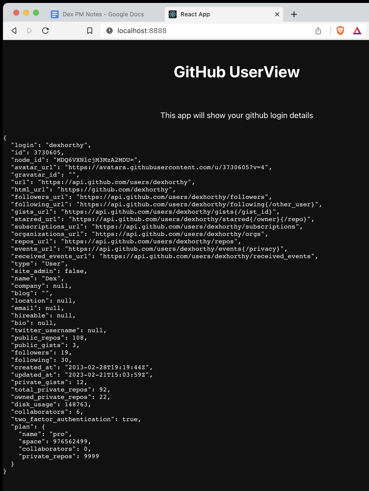
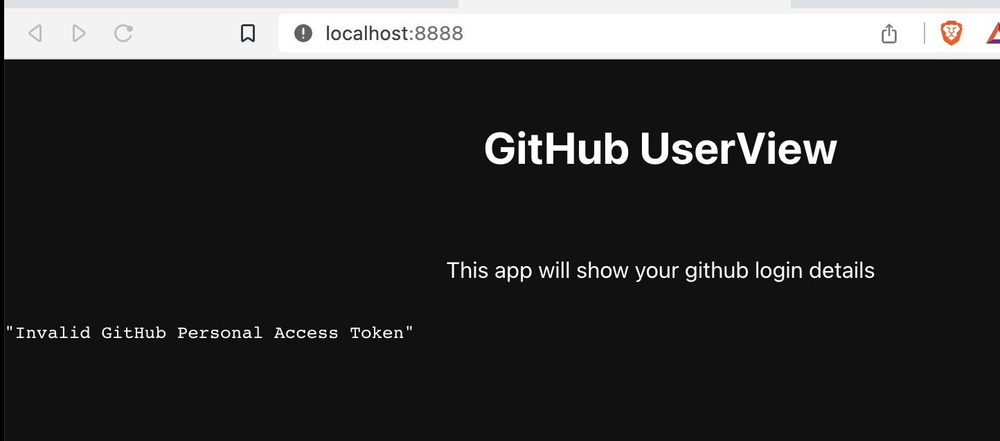

Replicated Helm Starter - sample app
==================


This is a sample application designed to help understand the process of creating a helm chart and replicated configuration for a real application.

> We have an app that runs in docker, and some basic helm scaffolding. How do we get it ready to ship with Replicated?


TODO - getting these sources checked out locally

```shell
git remote add template git@github.com:replicatedhq/replicated-starter-helm
git fetch template
git checkout -b sampleapp template/sampleapp
```


Later, you can push these to a branch of your repo, and use the GitHub UI to create a PR to merge them into master.

### The toy application

- Stateless Create-React-App frontend
- Stateless Golang Backend
  - Configured by environment variables
- Dockerfile for building the app and testing locally
- Basic helm chart structure for hello-world nginx app
- GitHub actions to build and push the application to GitHub Container Registry





It is notably missing a few things. These are intentionally left out to simulate the experience of a vendor exploring Replicated from scratch. This is designed as an exercise

- Correctly configured helm chart templates/values for this application
- KOTS basic manifests
- CI/CD configuration for packaging the helm chart and creating Replicated Releases
- Config screen options for providing key configuration fields at install time
- Conditional logic for exposing services on a NodePort in kURL
- kots-app / k8s-app manifests for exposing a service port the KOTS admin dashboard
- Preflight checks for the user-provided configuration
- support bundle specs for the application
- GitHub Actions configuration to push the image to the replicated registry
- Git SHA tagging for docker image versions in GitHub actions, and CI steps to inject a git sha into replicated config or helm values or manifests
- Any stateful services that a vendor might want to make embeddable/swappable


Your goal should be to take everything you know about replicated packaging, and work as a team to complete as many of these as you can.


### Testing locally

If you have docker running, you can see the app locally


```
docker built -t helm-starter .
docker run --rm -it -p 8888:8888 helm-starter
```

Then visit http://localhost:8888


You'll notice an error when you try to load the page, that's because you're likely missing the required environment variables.  



You can set a GitHub personal access token in your environment, before passing to the docker run command with `-e`


```
export GITHUB_PAT=... # set to a github personal access token with `user:read` scope
```

```
docker run --rm -it -p 8888:8888 -e GITHUB_PAT helm-starter
```


